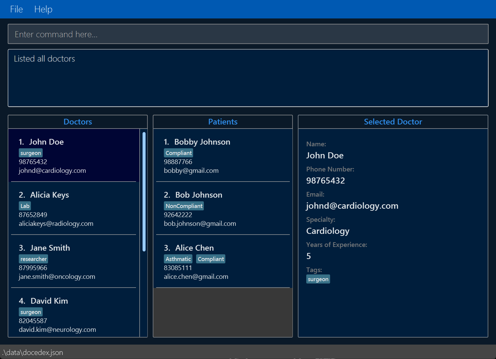

[//]: # (TODO: Change this link)

[//]: # (TODO: Change this link after codecov created!)

***Taking control of hospital administrative management is just a few keystrokes away!***

Docedex is a **desktop application** built for **medical administrative assistants**
to manage doctors and patients within clinics.

Here's a **quick snapshot** of how Docedex can help you
streamline your hospital management processes.
- Store and edit information about your patients and doctors
- Track the status of your patients and doctors
- Assign patients to doctors upon triaging

On top of these functionalities, we believe that patient management must be **efficient**.
Therefore, Docedex is **optimized for** use via a **Command Line Interface (CLI)**
while still having the benefits of a **Graphical User Interface (GUI).**
If you type fast, Docedex can get your hospital management tasks done faster
than current GUI apps in the industry.

* If you are interested in using Docedex, head over to the [_Quick Start_ section of the **User Guide**](UserGuide.html#quick-start).
* If you are interested about developing Docedex, the [**Developer Guide**](DeveloperGuide.html) is a good place to start.

**Acknowledgements**

* Libraries used: [JavaFX](https://openjfx.io/),
[Jackson](https://github.com/FasterXML/jackson),
[JUnit5](https://github.com/junit-team/junit5)
